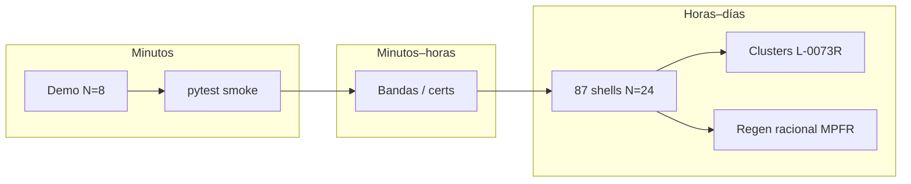
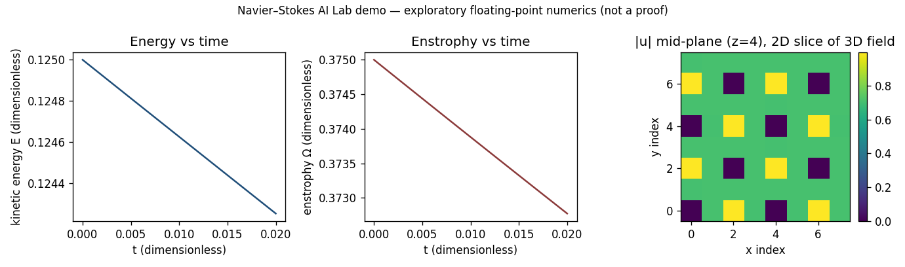
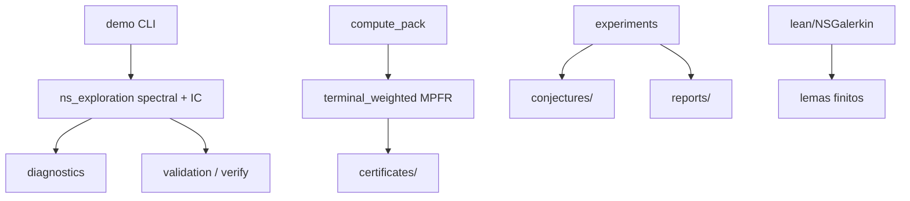

# Navier–Stokes AI Lab

**Experimentos numéricos asistidos por IA, herramientas de verificación y lecciones de una exploración matemática ambiciosa.**

[English](README.md) · [Arquitectura](docs/ARCHITECTURE.md) · [Estado](docs/PROJECT_STATUS.md) · [Contribuir](CONTRIBUTING.md)

> Laboratorio experimental personal sobre cómo la asistencia de IA puede apoyar simulación, conjeturas y verificación en torno a Navier–Stokes 3D. Documenta código útil, enfoques fallidos, correcciones y límites abiertos. **No afirma una solución al Problema del Premio del Milenio.**

Nombres históricos: **NS-MRL**, **bastardus2**. Imports: `ns_exploration`.

**Visibilidad:** el repositorio debe permanecer **privado** hasta que el mantenedor lo publique explícitamente.

---

## 1. Complejidad de lo construido

No fue un script suelto: creció hasta un laboratorio multi-lenguaje.

| Capa | Orden de magnitud |
|------|-------------------|
| Módulos Python | **~385** archivos |
| Tests | **~90** |
| Conjeturas activas | **~26** JSON |
| Certificados | **~66** JSON |
| Informes Markdown | **~88** |
| Shells full-dealias N=24 | **87** |
| Dimensión hermítica D | **≈ 6748** |
| Pares por shell one_inf | **~45.5 millones** |
| Campañas CPU | horas → días |

Eso mide **complejidad de ingeniería y exploración**, no un avance porcentual hacia Clay. **C-0008** sigue `exploring` (I_hi reparado ≈ 170.59 vs I_* ≈ 1.30).



---

## 2. Figura real de la demo



Comando: `python -m ns_exploration.demo`. Unidades adimensionales; panel derecho = corte 2D de un campo 3D.

---

## 3. Arquitectura del programa



Detalle completo (diagramas de secuencia, mapa de módulos, capas de verificación): **[docs/ARCHITECTURE.md](docs/ARCHITECTURE.md)** y la versión inglesa del README.

| Carpeta | Rol |
|---------|-----|
| `python/ns_exploration/` | Código activo |
| `conjectures/`, `certificates/`, `reports/` | Registro y evidencia |
| `lean/`, `julia/` | Opcional |
| `compute_pack/` | Jobs CPU largos portables |
| `artifacts/` | Snapshots fechados |

---

## 4. Inicio rápido

```bash
python3 -m venv .venv
source .venv/bin/activate   # Windows: .\.venv\Scripts\Activate.ps1
pip install -e ".[dev]"
python -m ns_exploration.demo
pytest python/ns_exploration/tests/test_sprint01.py python/ns_exploration/tests/test_demo.py -q
```

---

## 5. Integridad, IA y privacidad

- Etiquetas: [docs/SCIENTIFIC_INTEGRITY.md](docs/SCIENTIFIC_INTEGRITY.md)
- Papel de la IA (sin LLM en runtime): [docs/AI_EXPERIMENT.md](docs/AI_EXPERIMENT.md)
- Lecciones / bugs documentados: [docs/LESSONS_LEARNED.md](docs/LESSONS_LEARNED.md)
- Rutas absolutas personales sanitizadas (`<REPO_ROOT>`, etc.)
- Mantener el repo **privado** hasta decidir publicación: [docs/PUBLICATION_NOTES.md](docs/PUBLICATION_NOTES.md)

Clay: https://www.claymath.org/millennium/navier-stokes-equation/

## Licencia

MIT — [LICENSE](LICENSE).
