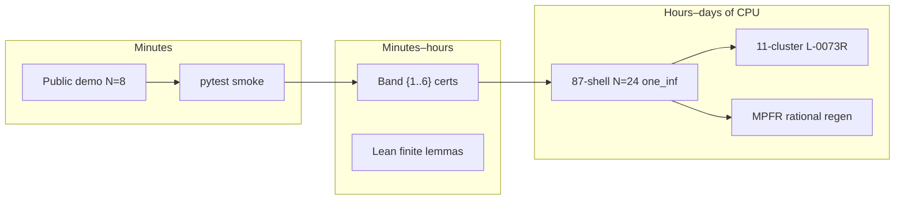
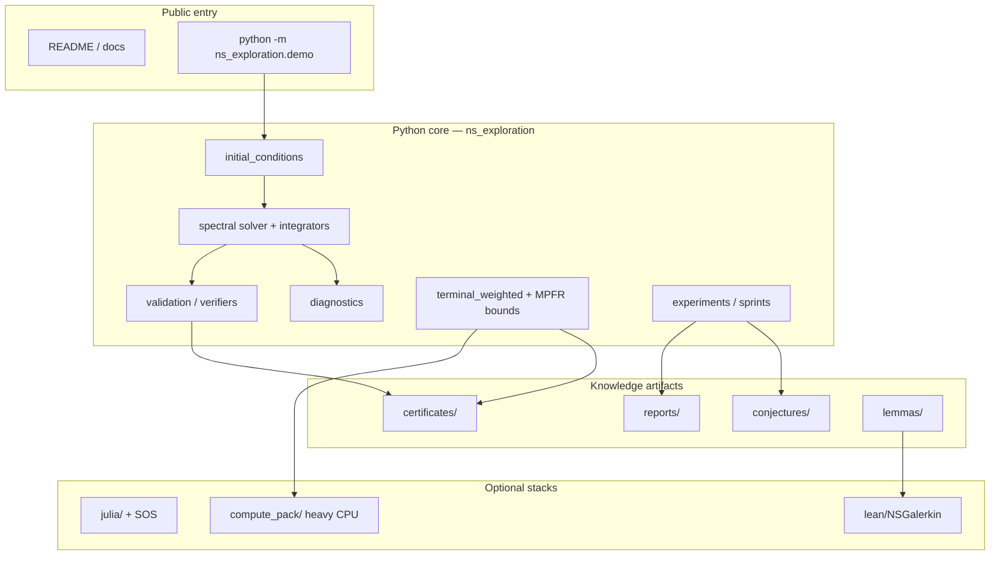
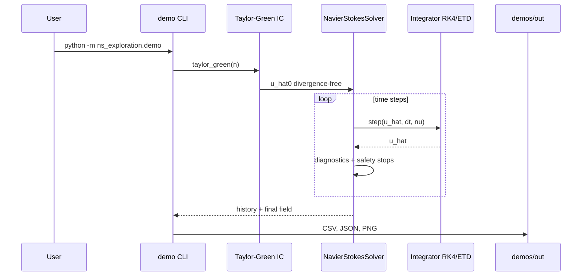
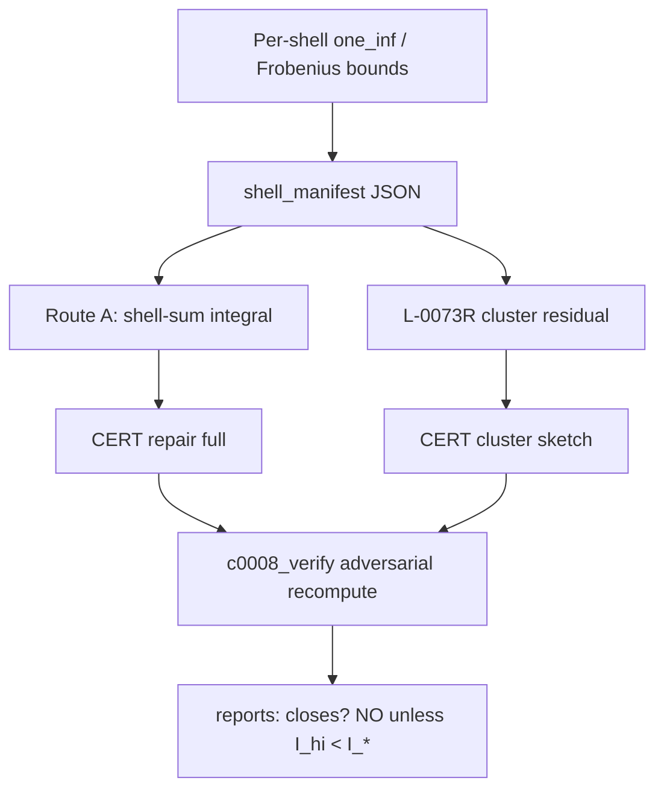

# Navier–Stokes AI Lab

**AI-assisted numerical experiments, verification tooling, and lessons from an ambitious mathematical exploration.**

[Español](README.es.md) · [Architecture deep-dive](docs/ARCHITECTURE.md) · [Project status](docs/PROJECT_STATUS.md) · [Contributing](CONTRIBUTING.md)

> A personal experimental laboratory exploring how AI assistance can support numerical simulation, conjecture exploration, and verification workflows around 3D Navier–Stokes. This repository documents working code, failed approaches, corrections, and unresolved limits. **It does not claim a solution to the Clay Millennium Prize Problem.**

Historical names in code and archives: **NS-MRL**, **bastardus2**. Python imports remain `ns_exploration`.

**Repository visibility:** intended to stay **private** until the maintainer explicitly publishes it. Do not treat a local clone as a public release.

---

## 1. Why this exists — and how complex it became

This started as a personal experiment: use AI tools to push toward hard questions around 3D incompressible Navier–Stokes. It grew into a multi-language research lab with solvers, conjecture registries, certificate pipelines, interval/MPFR arithmetic, Lean skeletons, Julia/SOS experiments, and long CPU campaigns.

### Scale of what was built (order-of-magnitude)

| Layer | Approx. size / complexity |
|-------|---------------------------|
| Python modules under `ns_exploration/` | **~385** `.py` files |
| Automated tests | **~90** `test_*.py` files |
| Active conjecture JSON records | **~26** |
| Certificate JSON artifacts | **~66** |
| Markdown campaign / audit reports | **~88** |
| Full-dealias shells at N=24 | **87** spherical shells |
| Hermitian basis dimension (N=24 full dealias) | **D ≈ 6748** |
| Pair updates per one_inf shell pass | **~45.5×10⁶** |
| Documented repair / audit campaigns | multi-week CPU (hours→days per full regen) |
| Languages | Python, Julia (optional), Lean 4 (finite identities) |

That complexity is **engineering and exploration complexity**, not evidence of a continuum proof. The sharp finite campaign **C-0008** remains `exploring`: honest repair Route A reports I_hi ≈ **170.59** vs target I_* ≈ **1.30** (see `reports/C0008_REPAIR_EVALUATION.md`).

### What “hard” meant in practice



---

## 2. Demo figure (real output)


Generated by `python -m ns_exploration.demo` (N=8, ν=0.05, dt=0.001, t_end=0.02, RK4). Units are **dimensionless**. The right panel is a **2D slice of a 3D field**.

---

## 3. Program architecture (detailed)

### 3.1 Top-level system



### 3.2 Solver pipeline (exploratory float)



**Terms:** *Galerkin truncation* keeps finitely many Fourier modes. *2/3 dealiasing* removes aliasing from products. *Leray projection* enforces divergence-free velocity in Fourier space. *Vorticity* ω = ∇ × u.

### 3.3 Certificate / repair stack (advanced)



**Important:** verifier `PASS` means the implemented checks succeeded under stated assumptions. It is **not** a continuum PDE proof and **not** automatic closure of C-0008.

### 3.4 Package map (`python/ns_exploration/`)

| Module | Role |
|--------|------|
| `spectral/` | Pseudospectral NS on T³, dealias, Leray, integrators |
| `initial_conditions/` | Taylor–Green, ABC, random div-free, vortex tubes |
| `diagnostics/` | Energy, enstrophy, divergence, tails |
| `validation/` | Intervals, certificate verify, repair pipeline |
| `terminal_weighted/` | Certified op-norms, clusters, MPFR paths |
| `conjectures/` | Lemma / conjecture helper code |
| `experiments/` | Sprint drivers (often expensive) |
| `demo.py` | Public budget-capped entrypoint |
| `tests/` | Pytest suite |

Full folder legend: [docs/ARCHITECTURE.md](docs/ARCHITECTURE.md).

---

## 4. What a visitor can do

| Goal | How |
|------|-----|
| Run a small simulation | `python -m ns_exploration.demo` |
| Read diagnostics | `demos/out/latest/` |
| Inspect a conjecture | `conjectures/active/C-0008.json` |
| Read repair honesty | `reports/C0008_REPAIR_EVALUATION.md` |
| Learn from failures | `docs/LESSONS_LEARNED.md` |
| AI-experiment framing | `docs/AI_EXPERIMENT.md` |
| Heavy portable CPU jobs | `compute_pack/README.md` (optional) |

---

## 5. Capabilities matrix

| Component | Status | Notes |
|-----------|--------|--------|
| Python solver | Working (exploratory N2) | RK4 / ETD-RK2 / semi-implicit |
| Public demo | Checked | Default N=8 ~0.1 s on a laptop CPU |
| Pytest smoke | Runnable | `test_sprint01` + `test_demo` |
| Certificate / MPFR repair | Present; costly | Needs `gmpy2`; N=24 = hours–days |
| Julia / SOS | Optional | Not required for demo |
| Lean NSGalerkin | Finite-identity skeleton | Not continuum NS |

---

## 6. Quick start

**Install from the repository root** (`pyproject.toml` → package `ns-mrl`). Nested `python/pyproject.toml` is an alternate path to the same tree.

### Linux / macOS

```bash
python3 -m venv .venv
source .venv/bin/activate
pip install -e ".[dev]"
python -m ns_exploration.demo
pytest python/ns_exploration/tests/test_sprint01.py python/ns_exploration/tests/test_demo.py -q
```

### Windows (PowerShell)

```powershell
python -m venv .venv
.\.venv\Scripts\Activate.ps1
pip install -e ".[dev]"
python -m ns_exploration.demo
pytest python/ns_exploration/tests/test_sprint01.py python/ns_exploration/tests/test_demo.py -q
```

Optional: `python/requirements-c0008-repair.txt` (MPFR), Julia, Lean 4.

---

## 7. Sample demo results (measured locally)

| Field | Value |
|-------|--------|
| IC | Taylor–Green |
| N, ν, dt, t_end | 8, 0.05, 0.001, 0.02 |
| Energy | 0.125 → ≈ 0.124252 |
| ‖div u‖₂ | ≈ 7×10⁻²² |
| Wall time | ≈ 0.1 s (machine-dependent) |
| Evidence | **N2** |

---

## 8. Integrity, AI use, and external context

- Evidence tags: [docs/SCIENTIFIC_INTEGRITY.md](docs/SCIENTIFIC_INTEGRITY.md) (internal N0–N11 convention).
- AI development experiment (no runtime LLM): [docs/AI_EXPERIMENT.md](docs/AI_EXPERIMENT.md).
- Clay Institute page: https://www.claymath.org/millennium/navier-stokes-equation/  
  This lab’s value does **not** depend on who resolves the continuum problem.

---

## 9. Privacy and publication policy

- Keep the GitHub repository **private** until the maintainer switches it to public.
- Absolute machine paths and local usernames are sanitized to placeholders (`<REPO_ROOT>`, etc.).
- Do not commit `.env`, API tokens, or credential files (see `.gitignore`).
- Before going public: re-run a secrets scan and follow [docs/PUBLICATION_NOTES.md](docs/PUBLICATION_NOTES.md).

---

## 10. License

MIT — see [LICENSE](LICENSE).
