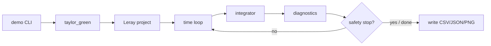
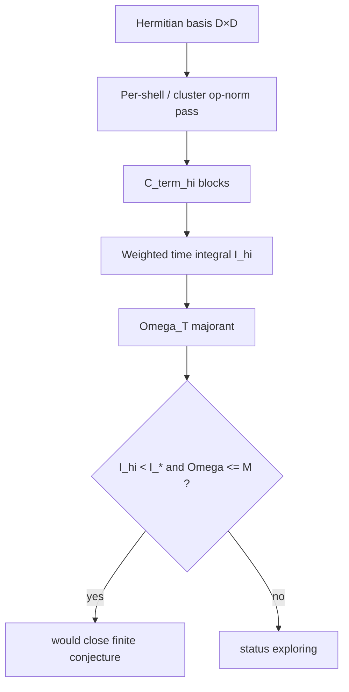
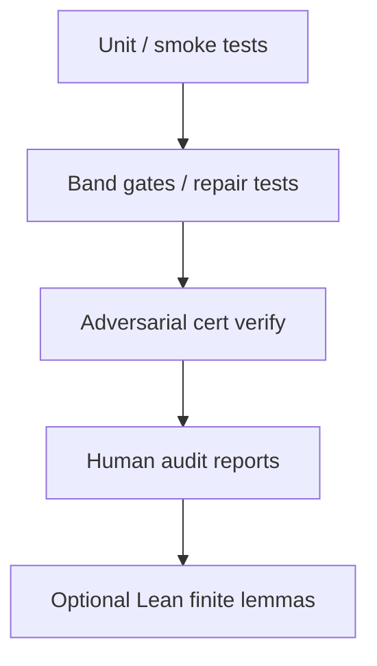

# Architecture — Navier–Stokes AI Lab

Companion to the root [README.md](../README.md). Describes how the program is organized end-to-end.

## 1. Repository layout

```text
.
├── python/ns_exploration/     # Active Python package (solver + campaigns)
├── conjectures/               # Conjecture registry JSON
├── certificates/              # Certificate JSON artifacts
├── reports/                   # Campaign write-ups and audits
├── lemmas/                    # Lemma sketches (Markdown)
├── docs/                      # Integrity, status, architecture, lessons
├── lean/                      # Lean 4 finite-identity skeletons
├── julia/                     # Optional Julia / SOS experiments
├── tools/                     # Helper scripts (e.g. Julia TSSOS runners)
├── experiments/               # Stored experiment outputs / manifests
├── compute_pack/              # Portable heavy-CPU job runner + data/
├── artifacts/                 # Dated handoff snapshots (not always live source)
├── demos/out/                 # Generated demo outputs (gitignored)
├── .github/workflows/         # demo-ci (light) + optional C-0008 band (heavy)
├── pyproject.toml             # Recommended install (root)
└── README.md
```

**Source of truth for code:** `python/ns_exploration/`.  
**Snapshots:** `artifacts/`, parts of `compute_pack/data/`. Prefer live paths when they disagree.

## 2. Runtime data flow (demo)



Safety stops (divergence, unexpected energy growth, crude CFL) are **heuristics**, not theorems.

## 3. Spectral stack

| Piece | File area | Responsibility |
|-------|-----------|----------------|
| Fourier conventions | `spectral/fourier_conventions.py` | FFT layout, energy from hats |
| Dealias mask | `spectral/dealias.py` | 2/3-rule mask |
| Leray | `spectral/leray.py` | Project to divergence-free |
| Nonlinear term | `spectral/operators.py` | Pseudospectral advection |
| Integrators | `spectral/integrators.py` | RK4, ETD-RK2, semi-implicit |
| Solver façade | `spectral/solver.py` | `SolverConfig` + `NavierStokesSolver.run` |

## 4. Terminal-weighted / certificate stack

Used for finite-dimensional bound campaigns (e.g. C-0008), not for the public demo.



Typical N=24 full-dealias numbers (reported under repair assumptions):

- 87 shells, D ≈ 6748  
- Route A I_hi ≈ 170.59 (primary honest bound after repair)  
- Cluster sketch I_hi ≈ 38.52 (audit pass; N7 cross-cluster gap)  
- Target I_* ≈ 1.30 — **not closed**

## 5. Verification layers



Each layer answers a **different** question. Climbing layers does not automatically imply continuum regularity.

## 6. Optional compute_pack

`compute_pack/` wraps long jobs with checkpoints, heartbeats, and a supervisor. All state under `compute_pack/data/`. See `compute_pack/README.md`. Not required to understand or run the demo.

## 7. Evidence discipline

See `docs/SCIENTIFIC_INTEGRITY.md`. Short rules:

- Float demo ⇒ N2  
- Certificate PASS ⇒ structure/assumption checks only  
- Lean file present ≠ built continuum theory  
- Historical “best” bounds may be **invalid** after repair audits
